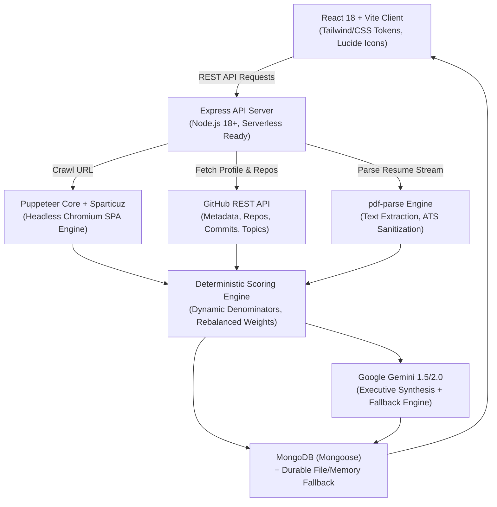

# PortfolioPulse

<div align="center">

**Evidence-Based Developer Career Intelligence & Portfolio Diagnostic Workspace**

[](package.json)
[](package.json)
[](package.json)
[](package.json)
[](LICENSE)

*Analyze, score, and optimize your developer portfolio, GitHub repositories, and resume against real-world technical recruiter standards with deterministic evidence and AI synthesis.*

[Live Demo](https://developer-portfolio-nu-rouge.vercel.app/) • [Features](#key-features) • [Architecture](#architecture--tech-stack) • [Getting Started](#getting-started) • [Scoring Engine](#scoring-engine--matrix) • [Security](#security--production-hardening)

</div>

---

## Overview

**PortfolioPulse** is a full-stack SaaS application that delivers deterministic, multi-source audits of software engineering candidates. Rather than relying solely on subjective AI prompts or naive static scrapers, PortfolioPulse combines **headless Chromium browser automation**, **deep GitHub metadata extraction**, and **ATS resume text parsing** to provide mathematically verified scoring, recruiter decision simulation, and role-specific career roadmaps.

Whether evaluating a single GitHub profile, a modern React/Vite Single-Page Application (SPA) portfolio, or an uploaded resume PDF, PortfolioPulse automatically correlates evidence across all three vectors, detects skill discrepancies, and surfaces prioritized, actionable improvements.

---

## Key Features

### 1. Multi-Vector 360° Profile Audit
- **Full 360° Mode**: Simultaneously audits GitHub repositories, live portfolio website, and resume PDF.
- **Flexible Modular Modes**: Supports standalone or dual-source audits (`github_resume`, `resume_portfolio`, `github_only`, `portfolio_only`, `resume_only`).
- **Provisional Weight Rebalancing**: Automatically recalculates active weights and scores when optional sources are omitted, ensuring developers are never penalized for unselected sources.

### 2. Resilient Headless SPA Portfolio Crawler
- **Observable Hydration Detection**: Utilizes Puppeteer with observable DOM conditions (`#root` child hydration, headings, minimum link counts) instead of blind sleeps, completing crawls reliably in ~2.3–2.6s.
- **Dynamic SPA Support**: Accurately inspects client-rendered React, Vue, Next.js, and Vite portfolios that render initial empty HTML shells.
- **Unhydrated Shell Protection**: Automatically detects incomplete DOM shells upon fallback and flags them as `unavailable` rather than penalizing developers with false-negative checklist failures.
- **Multi-Signal Link & Anchor Resolution**: Detects contact, resume, GitHub, and LinkedIn links via raw URLs, relative paths (`/resume.pdf`), document anchors, `aria-label`, `aria-labelledby`, and `title` attributes.

### 3. Evidence-Based Dynamic Denominator Scoring
- **Dynamic Denominator (`possible`)**: Automatically excludes `not_applicable` items (e.g. image alt-text checks when zero images exist on CSS/SVG-based sites) and `unavailable` crawler items from the total score denominator.
- **Truthful Audit Badges**: Every check displays clear, unambiguous statuses:
  - `PASS` (Present and verified with concrete proof)
  - `FAIL` (Genuinely absent with corrective guidance)
  - `N/A` (Not applicable; excluded from score calculation)
  - `UNAVAILABLE` (Inspection bounded or timed out; excluded without penalty)

### 4. Consolidated Portfolio Tab
- **Zero Duplication**: Consolidates 17 scored parameters into a single, unified checklist view complete with status badges, importance indicators, earned/max points, progress indicators, detected evidence, and actionable hints.
- **Isolated Structural Hygiene**: Segregates non-scoring SEO and best-practice checks (Optimal Title Length, Meta Description Length, Single H1 structure) into an **Additional Structural Checks** section so candidate guidance remains clear without distorting numerical scores.

### 5. Intelligent Technical Skill Filtering
- **Tool vs. Topic Discrimination**: Intelligently distinguishes genuine technical frameworks, libraries, and tools (e.g., Docker, Vite, D3.js, FastAPI, Prisma, React, Node.js) from repository project categories and domain labels (`hrms`, `leave-management-system`, `e-commerce`).
- **Alias Normalization**: Maps informal topic aliases to canonical technical names (e.g., `d3js` → `D3.js`, `fastapi` → `FastAPI`).
- **Scope-Aware Role Gaps**: Compares detected skills against industry role benchmarks (Full-Stack, Frontend, Backend, AI/ML, DevOps, Mobile) strictly within inspected sources.

### 6. Recruiter Decision Simulation & Consistency Matrix
- **Recruiter Decision Engine**: Models how engineering hiring managers and technical recruiters evaluate profiles for interview readiness, ATS keyword density, and signal-to-noise ratio.
- **Cross-Source Consistency**: Correlates technical skills claimed on the resume against active languages, commits, and dependencies observed in GitHub repositories.

### 7. Executive Synthesis & Milestoned Career Roadmap
- **Role-Specific Milestones**: Generates structured 30/60/90-day actionable improvement milestones mapped to the candidate's selected target role.
- **Deterministic Offline Fallback**: Features a deterministic fallback engine (`buildFallbackFeedback`) ensuring synthesis and roadmaps remain available even if LLM quotas expire or network timeouts occur.

### 8. SaaS Account Workspace & Shareable Snapshots
- **User Authentication**: Secure JWT-based authentication with 7-day signed sessions and password hashing (`scrypt`).
- **Tiered Credits**: Multi-tiered plans (Starter, Pro, Team) with monthly credit allocations and workspace usage dashboards.
- **Public Share URLs**: Generates unique, immutable public share IDs (`nanoid`) allowing developers to share diagnostic reports without exposing account data.

---

## Architecture & Tech Stack



### Frontend
- **Framework**: React 18 with React Router v6
- **Build Tool**: Vite 5
- **Icons**: Lucide React
- **Design**: Responsive dark-mode dashboard with custom CSS variables, progress bars, and responsive score gauges.

### Backend
- **Runtime**: Node.js (>= 18.x, ES Modules)
- **Framework**: Express 4
- **Headless Browser**: `puppeteer-core` with `@sparticuz/chromium-min` (optimized for Vercel and local environments)
- **HTML Parsing**: Cheerio
- **Document Processing**: `pdf-parse`, `multer`
- **Generative AI**: `@google/generative-ai` (Google Gemini SDK)
- **Database**: MongoDB via Mongoose with automatic fallback to in-memory store and `data/reports.json` disk persistence.
- **Security**: Custom SSRF validator with DNS resolution check, `cors`, `nanoid`.

---

## Project Structure

```text
PortfolioPulse-final/
├── api/                        # Serverless function entry points (Vercel)
│   └── index.js
├── controllers/                # Request handling & orchestration logic
│   ├── analyzeController.js    # Multi-source analysis, scoring, & report retrieval
│   ├── authController.js       # User registration, authentication, & workspace
│   └── resumeController.js     # Resume upload, sanitization, & synchronization
├── models/                     # Mongoose schemas
│   ├── Report.js               # Report snapshot schema
│   └── User.js                 # User profile, plan tiers, & usage schema
├── routes/                     # Express route declarations
│   ├── analyzeRoutes.js        # POST /api/analyze/full, GET /api/analyze/report/:id
│   ├── authRoutes.js           # Auth & workspace management routes
│   └── resumeRoutes.js         # POST /api/resume/analyze
├── services/                   # Core business logic engines
│   ├── aiService.js            # Gemini AI narrative generation & fallback feedback
│   ├── githubService.js        # GitHub API extraction, repos, commits, & topics
│   ├── portfolioService.js     # Headless Chromium crawler, SPA hydration & DOM check
│   ├── resumeService.js        # PDF text parsing & ATS keyword detection
│   └── scoringService.js       # Dynamic denominator scoring, weights & consistency
├── src/                        # React frontend application
│   ├── components/             # Reusable UI components (Navbar, Footer, Modals)
│   ├── context/                # Authentication & Theme context providers
│   ├── pages/                  # Top-level views (HomePage, ResultsPage, DashboardPage)
│   ├── services/               # Frontend API client (Axios with interceptors)
│   ├── utils/                  # UI formatters & presentation helpers
│   ├── App.jsx                 # Route definitions
│   ├── main.jsx                # Application root
│   └── styles.css              # Global tokens, component styles, and animations
├── utils/                      # Backend utility libraries
│   ├── auth.js                 # JWT signing & verification middleware
│   ├── connectDatabase.js      # MongoDB connector with auto-reconnect & fallback
│   ├── portfolioConstants.js   # Scored checklist mapping dictionaries
│   ├── rateLimit.js            # In-memory IP rate limiter
│   └── ssrf.js                 # SSRF private IP & internal host protection
├── server.js                   # Local Express application runner
├── vercel.json                 # Vercel deployment & routing configuration
└── package.json                # Project dependencies & scripts
```

---

## Getting Started

### Prerequisites
- **Node.js**: `v18.0.0` or later (tested on Node 20 & 24)
- **npm** or **pnpm**
- *(Optional)* **MongoDB** instance (local or MongoDB Atlas)
- *(Optional)* **Google Gemini API Key** (for live LLM generation)
- *(Optional)* **GitHub Personal Access Token** (to prevent rate-limiting on high volume)

### 1. Installation

Clone the repository and install dependencies:

```bash
git clone https://github.com/rakeshkumar0804/dev-portfolio-checker.git
cd dev-portfolio-checker
npm install
```

### 2. Configure Environment Variables

Create a `.env` file in the root directory (based on `.env.example`):

```bash
# Windows PowerShell:
Copy-Item .env.example .env

# Linux / macOS:
cp .env.example .env
```

Edit `.env` with your desired configuration:

```env
# Client & Server
PORT=5000
NODE_ENV=development
CLIENT_URL=http://localhost:5173

# Authentication (Required for secure production sessions)
JWT_SECRET=your_super_secret_random_string_here

# Optional: Cloud Database (Falls back to disk/memory storage if empty)
MONGODB_URI=mongodb://localhost:27017/portfoliopulse

# Optional: Integrations
GEMINI_API_KEY=your_gemini_api_key_here
GITHUB_TOKEN=your_github_personal_access_token_here
```

### 3. Running the Application

You can run the backend and frontend concurrently in two terminals:

#### Terminal 1: Backend API Server
```bash
# Starts Express server on http://localhost:5000
npm run start
# Or with auto-reload:
npm run dev:api
```

#### Terminal 2: Vite Frontend Dev Server
```bash
# Starts Vite dev server on http://localhost:5173
npm run dev
```

Open [http://localhost:5173](http://localhost:5173) in your browser to start auditing profiles.

### 4. Production Build

To test and compile the production bundle:

```bash
npm run build
```

The compiled assets will be written to `dist/`.

---

## Scoring Engine & Matrix

PortfolioPulse utilizes an evidence-backed scoring algorithm where each pillar evaluates critical industry indicators:

### 1. Portfolio Audit (100 Points Max)
| Category | Check | Points | Description |
| :--- | :--- | :---: | :--- |
| **Security & UX** | HTTPS Secure | 8 | Valid SSL/TLS certificate. |
| | Mobile Responsive | 8 | Standard viewport meta tag configured. |
| | Fast Loading / Size | 4 | Compressed HTML payload under 500 KB. |
| | Accessibility | 5 | Valid language attribute and accessible anchors. |
| **Contact & Socials**| Resume Link | 10 | Direct accessible resume download (PDF or doc). |
| | GitHub Link | 8 | Valid GitHub profile link detected. |
| | LinkedIn Link | 8 | Valid LinkedIn profile link detected. |
| | Contact Section | 6 | Form, contact modal, or transmission channel. |
| | Email Link | 5 | Direct `mailto:` or contact email address. |
| | Twitter/X Link | 3 | Developer presence on Twitter/X. |
| **Content & SEO** | Projects Section | 10 | Dedicated project showcase section with links. |
| | Page Title | 6 | Non-empty descriptive `<title>` tag. |
| | H1 Heading | 6 | Valid primary heading presenting candidate role. |
| | Meta Description | 5 | Search engine meta description present. |
| | Open Graph Tags | 5 | `og:title` and `og:description` social tags. |
| | Social Share Image | 4 | `og:image` configured for preview cards. |
| | Image Alt Tags | 4 | Descriptive alt attributes *(marked N/A if 0 images exist)*. |

### 2. GitHub Evaluation (100 Points Max)
- **Repository Quality & Stars (25 pts)**: Original repositories, non-fork showcase projects, and community engagement.
- **Commit Recency & Activity (25 pts)**: Active contribution cadence and recent commits over the past 90 days.
- **Documentation & READMEs (25 pts)**: Detailed project overviews, setup guides, and architecture explanations.
- **Language & Tech Stack Breadth (25 pts)**: Multi-language proficiency and modern technology adoption.

### 3. Resume ATS Evaluation (100 Points Max)
- **Action Verbs & Impact (30 pts)**: Strong leadership and engineering verbs (e.g., *Architected*, *Implemented*, *Optimized*).
- **Quantified Business Metrics (30 pts)**: Measurable metrics (e.g., *reduced latency by 40%*, *scaled to 100k users*).
- **Contact & Essential Structure (20 pts)**: Clean header with email, phone, location, and professional links.
- **Role Skill Alignment (20 pts)**: Relevance of extracted tools against the selected target role.

---

## Security & Production Hardening

- **SSRF Mitigation**: Public URL inspection is protected by strict IP validation. Private networks (`10.0.0.0/8`, `172.16.0.0/12`, `192.168.0.0/16`), localhost (`127.0.0.1`, `::1`), link-local addresses (`169.254.0.0/16`), and cloud metadata services (`metadata.google.internal`, `169.254.169.254`) are blocked via asynchronous DNS resolution checks before any HTTP or Puppeteer connection is initiated.
- **Serverless Timeout Guardians**: All background crawls and Gemini calls are bounded by strict timeout cancellation tokens (`Promise.race`), ensuring full pipeline completion well within serverless platform limits (e.g., Vercel's 15-second budget).
- **File Upload Safeguards**: Resume uploads are validated via binary PDF magic-byte checks (`%PDF-`), capped at 5 MB, processed strictly in memory/temporary storage, and automatically removed immediately following analysis.
- **Password Protection**: Passwords are securely hashed with Node's native `crypto.scrypt` with cryptographic salts; credentials are never logged or stored in plaintext.
- **CORS & Headers**: Strict CORS policies with configurable origin whitelists, accompanied by `X-Content-Type-Options: nosniff`, `X-Frame-Options: DENY`, and `Referrer-Policy: strict-origin-when-cross-origin`.

---

## Contributing

Contributions are welcome! To contribute:

1. Fork the repository.
2. Create a feature branch (`git checkout -b feature/amazing-feature`).
3. Commit your changes (`git commit -m "feat: add amazing feature"`).
4. Push to the branch (`git push origin feature/amazing-feature`).
5. Open a Pull Request.

---

## License

This project is licensed under the MIT License — see the [LICENSE](LICENSE) file for details.
